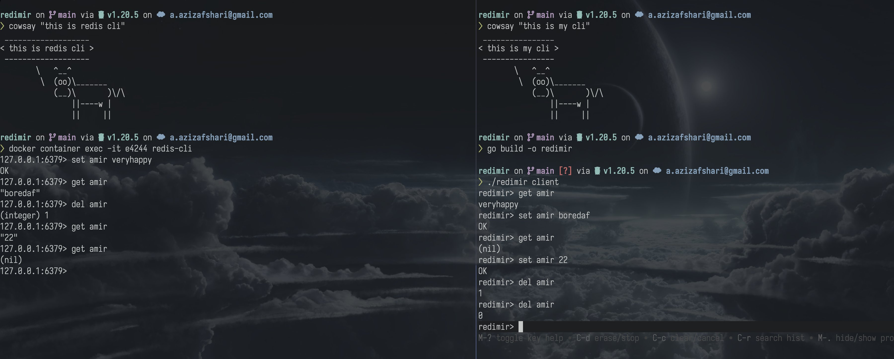

<!-- PROJECT LOGO -->
 

<h3 align="center">redimir</h3>

    A Redis client made in Go supporting get, set, del
     
    <!-- <a href="https://github.com/amir002001/redimir"><strong>Explore the docs »</strong></a> -->
  

<!-- TABLE OF CONTENTS -->

  
Table of Contents

  <ol>
    <li>
      <a href="#about-the-project">About The Project</a>
      <ul>
        <li><a href="#built-with">Built With</a></li>
      </ul>
    </li>
    <li><a href="#acknowledgement">Acknowledgement</a></li>
    <li><a href="#contact">Contact</a></li>
  </ol>

## About The Project

I found a really cool book about [creating my own Redis](#acknowledgement) so I
did this project for a weekend. you can find a writeup on my
[blog](https://amir.day/projects/redimir) about my findings.

(<a href="#readme-top">back to top</a>)

## Acknowledgement

- [Build your own Redis](https://build-your-own.org/redis/)
- [Redis RESP Docs](https://redis.io/docs/reference/protocol-spec/)
- [Bubbles and sparkles: refreshing our SQL shell](https://www.cockroachlabs.com/blog/cockroachdb-cli-improvements/)

(<a href="#readme-top">back to top</a>)

## Contact

Amir Azizafshari - [@AmirLovesKiwis](https://twitter.com/amirloveskiwis) -
its@amir.day

Project Link:
[https://github.com/amir002001/redimir](https://github.com/amir002001/redimir)

(<a href="#readme-top">back to top</a>)

[contributors-shield]: https://img.shields.io/github/contributors/amir002001/redimir.svg?style=for-the-badge
[contributors-url]: https://github.com/amir002001/redimir/graphs/contributors
[forks-shield]: https://img.shields.io/github/forks/amir002001/redimir.svg?style=for-the-badge
[forks-url]: https://github.com/amir002001/redimir/network/members
[stars-shield]: https://img.shields.io/github/stars/amir002001/redimir.svg?style=for-the-badge
[stars-url]: https://github.com/amir002001/redimir/stargazers
